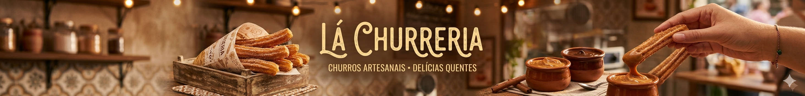

 

 

<h2>📌 Sobre o Projeto</h2>

Este projeto consiste no desenvolvimento de uma <b>Landing Page Gastronômica</b> para a "Lá Churreria". O objetivo principal foi criar um visual apetitoso e profissional, utilizando uma hierarquia visual clara. O desafio técnico envolveu o posicionamento preciso de textos e botões sobre uma imagem de fundo complexa, garantindo que o slogan não obstruísse a identidade visual da marca, além de implementar interatividade para melhorar a experiência do usuário.

 

<h1 align="center"> Preview da Aplicação 📸 </h1>
<video src="https://github.com/user-attachments/assets/4372e2c8-8f96-498c-ac8f-619b9654fd5c"></video>

  

 

<h2>✨ Funcionalidades e Destaques</h2>

<ul>
  <h3>
    <li>🎨 Design Imersivo: Utilização de imagens de alta qualidade com tons quentes (madeira e dourado) para evocar a sensação de conforto e sabor.</li> 
     
    <li>📏 Ajuste de Camadas: Implementação de correções via CSS para que o slogan "Crocante por fora..." fosse deslocado verticalmente, evitando a sobreposição com o texto institucional do banner.</li> 
     
    <li>⚡ Interatividade com JS: Manipulação de eventos para tornar a navegação mais fluida e preparar o sistema para futuras integrações de pedidos online.</li> 
     
    <li>🔘 Botões de Chamada (CTA): Menu interativo com botões estilizados para navegação rápida entre Churros, Bebidas, Pedidos e Contato.</li> 
  </h3>
</ul>

 

<h2>🛠️ Tecnologias e Ferramentas</h2>

Para a construção deste projeto, utilizei o trio fundamental da web para garantir performance e total controle sobre o design:

<table>
  <tr>
    <td align="center" width="150">
       
      <b>HTML5</b>
    </td>
    <td>
      <strong>Estrutura Semântica:</strong> Organização dos elementos do banner, links de navegação e seções de texto para garantir que o conteúdo seja acessível e bem interpretado.
    </td>
  </tr>
  <tr>
    <td align="center" width="150">
       
      <b>CSS3</b>
    </td>
    <td>
      <strong>Estilização Avançada:</strong> Controle de <code>margins</code> e <code>z-index</code> para evitar sobreposição, além do uso de <strong>Flexbox</strong> para alinhar perfeitamente os botões de menu.
    </td>
  </tr>
  <tr>
    <td align="center" width="150">
       
      <b>JavaScript</b>
    </td>
    <td>
      <strong>Lógica e Dinamismo:</strong> Responsável por adicionar comportamento aos botões, permitir transições suaves entre as seções e preparar a interface para funções de carrinho ou contato dinâmico.
    </td>
  </tr>
</table>

 

 

## 👨‍💻 Desenvolvido por

### Thiago Saboia

Estudante de Engenharia de Software  
Unicesumar – Londrina

 

